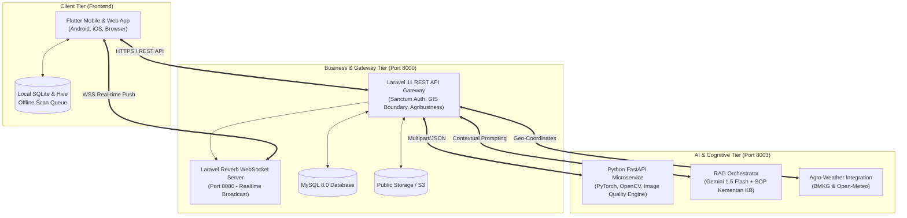

# 🌾 P.A.D.I. (Predictive Agriculture & Disease Intelligence)

<div align="center">

[](https://kmipn.pnp.ac.id/)
[](https://polindra.ac.id/)
[](https://polindra.ac.id/)

**Platform Cerdas Pendukung Keputusan Petani Padi: Dari Prediksi Pra-Tanam, Deteksi Hama Penyakit Berbasis AI & RAG, Monitoring Irigasi AWD, hingga Marketplace Hasil Panen.**

---

[](https://flutter.dev)
[](https://laravel.com)
[](https://fastapi.tiangolo.com)
[](https://ai.google.dev)
[](https://laravel.com/docs/reverb)
[](https://mysql.com)

</div>

---

## 📑 Daftar Isi

1. [Tentang P.A.D.I.](#-tentang-padi)
2. [Latar Belakang & Permasalahan](#-latar-belakang--permasalahan)
3. [Solusi & Keunggulan Inovasi](#-solusi--keunggulan-inovasi)
4. [Arsitektur Sistem (Multi-Tier Architecture)](#-arsitektur-sistem-multi-tier-architecture)
5. [Mekanisme AI Vision & RAG (Deep Dive)](#-mekanisme-ai-vision--rag-deep-dive)
6. [Fitur-Fitur Utama Platform](#-fitur-fitur-utama-platform)
7. [Dataset & Sumber Data Terintegrasi](#-dataset--sumber-data-terintegrasi)
8. [Struktur Repositori](#-struktur-repositori)
9. [Panduan Instalasi & Menjalankan Service](#-panduan-instalasi--menjalankan-service)
10. [Spesifikasi API Utama](#-spesifikasi-api-utama)
11. [Profil Pengembang (Team Fantastic)](#-profil-pengembang-team-fantastic)
12. [Lisensi & Hak Cipta](#-lisensi--hak-cipta)

---

## 💡 Tentang P.A.D.I.

**P.A.D.I. (*Predictive Agriculture & Disease Intelligence*)** adalah ekosistem aplikasi cerdas *all-in-one* yang dikembangkan oleh **Team Fantastic** dari **Politeknik Negeri Indramayu** untuk ajang **KMIPN VIII 2026**. 

Platform ini dirancang khusus untuk memodernisasi sektor pertanian pangan Indonesia dengan mentransformasikan ponsel petani menjadi **asisten agronomi digital pribadi**. P.A.D.I. mengintegrasikan telemetri cuaca agroklimat (*BMKG & Open-Meteo*), pemetaan GIS batas wilayah nasional, visi komputer berbasis *Deep Learning*, penalaran klinis tanaman menggunakan **RAG (*Retrieval-Augmented Generation*) & Google Gemini AI**, serta sistem transmisi notifikasi *real-time* via **Laravel Reverb**.

---

## ⚠️ Latar Belakang & Permasalahan

Sektor budidaya padi di Indonesia menghadapi tiga tantangan krusial di tingkat lapangan:

1. **Ketidakpastian Musim & Jadwal Tanam:**
   Anomali iklim global (El Niño / La Niña) membuat pola kalender tanam tradisional (*Pranata Mangsa*) tidak lagi akurat, menyebabkan risiko kegagalan semai akibat kekeringan mendadak atau banjir.
2. **Keterlambatan Deteksi Hama & Penyakit:**
   Rasio Penyuluh Pertanian Lapangan (PPL) yang sangat terbatas dibandingkan luas lahan membuat petani sering terlambat mengenali gejala penyakit (seperti Blas dan Hawar Daun Bakteri), berujung pada puso atau penggunaan pestisida kimia berlebihan yang merusak ekosistem.
3. **Asimetri Informasi Pasar & Catatan Usaha Tani yang Lemah:**
   Petani jarang memiliki pencatatan modal kerja (HPP) yang rapi dan terpaksa menjual gabah ke tengkulak dengan harga rendah akibat minimnya akses langsung ke pembeli komoditas.

---

## 🚀 Solusi & Keunggulan Inovasi

| Masalah Konvensional | Pendekatan Solusi P.A.D.I. | Dampak Langsung Petani |
| :--- | :--- | :--- |
| Prediksi cuaca terlalu umum dan tidak aplikatif | **Predictive Agroweather Engine**: Menghubungkan parameter BMKG (Suhu, RH, Curah Hujan, Evapotranspirasi) ke jendela rekomendasi tanam | Mengurangi risiko gagal semai dan pembusukan benih |
| Diagnosa daun padi lambat & rawan salah dosis | **Multi-Stage AI Vision + Domain-Specific RAG**: Pengecekan kualitas foto $\rightarrow$ Segmentasi lesi $\rightarrow$ Klasifikasi CNN $\rightarrow$ Rekomendasi obat resmi Kementan via Gemini AI | Diagnosa instan dalam 3 detik, dosis kimia terstandar |
| Notifikasi bergantung pada vendor asing / FCM | **Independent WebSocket (Laravel Reverb)**: Notifikasi peringatan dini wabah radius 5-25 km dikirim instan tanpa ketergantungan token FCM | Alert komunitas seketika dan hemat biaya infrastruktur |
| Penggunaan air irigasi boros | **Smart AWD (Alternate Wetting & Drying)**: Penjadwalan pengairan berselang sesuai fase Hari Setelah Tanam (HST) | Hemat konsumsi air irigasi hingga 25-30% |
| Hasil AI tidak diawasi manusia | **Human-in-the-Loop Validation**: Fitur eskalasi kasus ke Penyuluh Pertanian Lapangan (PPL) untuk verifikasi lapangan | Rekomendasi kredibel dan terawasi ahli agronomi |

---

## 🏗️ Arsitektur Sistem (Multi-Tier Architecture)

P.A.D.I. dibangun menggunakan arsitektur microservices hibrida yang memisahkan beban kerja logika bisnis, komputasi AI berkecepatan tinggi, dan transmisi real-time:



---

## 🧠 Mekanisme AI Vision & RAG (Deep Dive)

### 1. Multi-Stage AI Computer Vision Pipeline
Setiap foto daun yang dikirimkan diproses melalui 3 gerbang (*pipeline stages*):
1. **Stage 1: Image Quality Assessment (IQA)**
   - Menguji *Laplacian Variance* (ketajaman fokus) dan kontras intensitas.
   - Mencegah foto buram atau gambar gelap diproses keliru oleh model inferensi.
2. **Stage 2: Leaf Segmentation & Feature Extraction**
   - Menghitung indeks *Excess Green* (ExG) dan segmentasi lesi bercak daun.
   - Mengukur luas klorosis (menguning) dan nekrosis (jaringan mati).
3. **Stage 3: Deep Learning Disease Classifier**
   - Mengidentifikasi 5 status daun padi:
     - **Blas Daun (*Magnaporthe oryzae*)**
     - **Hawar Daun Bakteri / HDB (*Xanthomonas oryzae*)**
     - **Bercak Cokelat (*Bipolaris oryzae*)**
     - **Tungro (Virus RTBV)**
     - **Daun Sehat (*Healthy*)**

### 2. Retrieval-Augmented Generation (RAG) Anti-Halusinasi
Agar petani tidak diberikan saran dosis kimia yang salah atau mengarang, sistem menerapkan pola RAG:
* **Retrieval:** Saat penyakit terdeteksi, sistem menarik SOP penanganan resmi Kementerian Pertanian & IRRI dari *Knowledge Base* lokal, serta menyerap cuaca aktual (suhu, kelembapan) di sawah tersebut.
* **Augmentation:** Prompt disusun dengan aturan ketat: *Hanya boleh menyebutkan bahan aktif resmi terdaftar (Trisiklazol, Azoksistrobin, dll.), melarang dosis spekulatif, dan wajib mempertimbangkan kelembapan udara saat ini.*
* **Generation:** Model **Google Gemini 1.5 Flash** dipanggil dengan parameter **`temperature: 0.0`** (deterministik mutlak) untuk menyusun rencana penanganan taktis terstruktur.

---

## 🌟 Fitur-Fitur Utama Platform

### 1. 🌦️ Predictive Farming & Rekomendasi Tanam
* Dashboard cuaca real-time dan prakiraan 7 hari ke depan berbasis data spasial lintang/bujur sawah.
* Analisis indeks agroklimat yang menghasilkan rekomendasi konkret: **Baik untuk Menanam**, **Waspada**, atau **Tunda Tanam**.

### 2. 🌾 Manajemen Lahan & Kalender Pertumbuhan Riil (HST Tracker)
* Pendaftaran poligon lahan dengan peta interaktif Leaflet GIS.
* Pelacakan 5 fase pertumbuhan padi dari Hari Setelah Tanam (HST) hingga estimasi tanggal panen:
  * *Fase Semai (H-21 s/d H-1)*
  * *Fase Vegetatif Awal (1 - 30 HST)*
  * *Fase Vegetatif Aktif / Anakan Maksimum (31 - 55 HST)*
  * *Fase Bunting & Pembungaan / Generatif (56 - 85 HST)*
  * *Fase Pematangan Bulir & Panen (86 - 115 HST)*

### 3. 💧 Sistem Irigasi Berselang Cerdas (AWD Monitoring)
* Panduan pengaturan ketinggian muka air genangan sawah (2-3 cm saat anakan, pengeringan bertahap 10-14 hari sebelum panen).
* Peringatan kekurangan air otomatis untuk sawah tadah hujan dan rekomendasi pintu air untuk sawah rawa pasang surut.

### 4. 🧪 Kalkulator Pupuk Presisi
* Menghitung kebutuhan pupuk majemuk & tunggal (Urea, NPK Phonska, KCl) berdasarkan luas lahan (hektare/bata) dan dosis anjuran resmi per fase tanam.

### 5. 🚨 Community Early Warning System & Push Reverb
* Jika ada serangan hama/penyakit di suatu petak, sistem menghitung radius bahaya (5-25 km) dan menyebarkan peringatan dini secara real-time melalui WebSocket Laravel Reverb.
* Privasi titik koordinat petani disamarkan (*location obfuscation*) untuk keamanan data publik.

### 6. 👨‍🌾 Human-In-The-Loop (PPL Expert Validation)
* Kasus diagnosa dengan tingkat keyakinan meragukan dapat dieskalasi ke Penyuluh Pertanian Lapangan (PPL).
* PPL memiliki portal khusus untuk memberikan verifikasi resmi, catatan lapang, dan rekomendasi tervalidasi.

### 7. 💰 Jurnal Finansial & Agribusiness Marketplace
* Pembukuan arus kas usaha tani: modal bibit, sewa alsintan, pupuk, upah buruh, dan kalkulasi margin keuntungan.
* Marketplace hasil panen (GKP, GKG, Beras Medium & Premium) yang menghubungkan kelompok tani langsung dengan pembeli dan mitra serap gabah.

---

## 🗺️ Dataset & Sumber Data Terintegrasi

1. **Batas Wilayah Geospasial Nasional:** 38 Provinsi, 514 Kabupaten/Kota, dan 7.264 Kecamatan se-Indonesia format OGC GeoJSON standar Kepmendagri/BPS.
2. **Data Agroklimat:** BMKG Open Data & Open-Meteo Agro Weather API ($ET_0$, radiasi surya, suhu, kelembapan, curah hujan).
3. **Dataset Citra Patologi Padi:** Ribuan citra daun padi lapangan terverifikasi dengan variasi pencahayaan alamiah tropis.
4. **Knowledge Base SOP Perlindungan Tanaman:** Standar operasional prosedur Balai Besar Penelitian Tanaman Padi (BBPadi Sukamandi) dan Kementerian Pertanian RI.

---

## 📂 Struktur Repositori

```text
Hackathon KMIPN/
├── Backend/
│   └── backend-apk-padi/         # Laravel 11 REST API, Reverb WebSocket, Migrations & Seeds
├── Frontend/
│   └── apk_padi/                 # Flutter Mobile & Web Client (Riverpod, Clean Architecture)
├── ai-service/                   # Python FastAPI AI Microservice (Uvicorn :8003)
│   ├── app/
│   │   ├── services/             # IQA, Leaf Segmenter, Padi Classifier, Decision Engine
│   │   └── main.py
├── docs/                         # Dokumen PRD, ERD, Panduan Penggunaan & Arsitektur
├── padi-web/                     # Web Portal / Landing Page
├── run_services.bat              # Batch Script Peluncur Seluruh Service Otomatis
├── start_reverb.bat              # Batch Script Reverb WebSocket Server
└── README.md                     # Dokumentasi Utama Repositori
```

---

## ⚙️ Panduan Instalasi & Menjalankan Service

### Prasyarat Sistem
* **PHP 8.2 / 8.4** & **Composer**
* **Node.js 18+** & **NPM**
* **Python 3.10 / 3.11** & **Pip**
* **Flutter SDK 3.24+**
* **MySQL 8.0**

### 1. Menjalankan Backend Laravel (Port 8000)
```bash
cd Backend/backend-apk-padi
composer install
cp .env.example .env
php artisan key:generate
php artisan migrate --force
php artisan storage:link
php artisan serve --host=0.0.0.0 --port=8000
```

### 2. Menjalankan WebSocket Server (Laravel Reverb - Port 8080)
Buka terminal baru:
```bash
cd Backend/backend-apk-padi
php artisan reverb:start --host=0.0.0.0 --port=8080 --debug
```

### 3. Menjalankan AI Microservice (FastAPI - Port 8003)
Buka terminal baru:
```bash
cd ai-service
python -m venv .venv

# Windows PowerShell:
.\.venv\Scripts\Activate.ps1

pip install -r requirements.txt
uvicorn app.main:app --host 0.0.0.0 --port 8003 --reload
```

### 4. Menjalankan Aplikasi Flutter Frontend
Buka terminal baru:
```bash
cd Frontend/apk_padi
flutter pub get

# Jalankan di Chrome (Web):
flutter run -d chrome

# Atau jalankan di perangkat Android fisik/emulator:
flutter run
```

> **Tips Cepat:** Pada sistem Windows, Anda dapat langsung mengklik dua kali file `run_services.bat` di root direktori untuk menyalakan ketiga service secara otomatis.

---

## 📡 Spesifikasi API Utama

| Metode | Endpoint | Deskripsi Fungsi |
| :---: | :--- | :--- |
| `POST` | `/api/v1/auth/login` | Otentikasi pengguna & penerbitan Bearer Token Sanctum |
| `GET` | `/api/v1/farms` | Mengambil daftar poligon lahan milik petani |
| `POST` | `/api/v1/farms` | Menambahkan lahan baru dengan koordinat GIS & tipe irigasi |
| `GET` | `/api/v1/farms/{id}/weather` | Mengambil cuaca agroklimat dan indeks evaporasi sawah |
| `POST` | `/api/v1/fertilizer/calculate` | Menghitung dosis pupuk berimbang per fase HST |
| `POST` | `/api/v1/disease-scans` | Unggah citra daun padi untuk inferensi AI Vision & RAG |
| `GET` | `/api/v1/community-alerts` | Peringatan dini persebaran penyakit dalam radius geospasial |
| `POST` | `/api/v1/ppl/validations` | Verifikasi diagnosis penyakit oleh Penyuluh Lapangan |
| `GET` | `/api/v1/market-listings` | Menampilkan etalase jual beli gabah dan beras |

---

## 👥 Profil Pengembang (Team Fantastic)

<div align="center">

**Politeknik Negeri Indramayu — KMIPN VIII 2026**

| Nama Anggota | NIM | Peran Utama | Fokus Tanggung Jawab |
| :--- | :---: | :--- | :--- |
| **Faiz Jihad Al Baihaqi** | `2403078` | **Product & Backend Lead** | System Architecture, Laravel REST API Gateway, Reverb WebSocket, MySQL Schema, RAG Pipeline |
| **Audy Zahra Aditya Putri** | `2403023` | **Mobile & UX Lead** | Flutter UI/UX Design System, Offline-First SQLite Sync, Camera Integration, State Management |
| **Yolanda Nurul Haq** | `2403021` | **AI/ML & Quality Lead** | Deep Learning Vision Pipeline, IQA Engine, SOP Knowledge Base Curating, Testing & Verification |

</div>

---

## 📄 Lisensi & Hak Cipta

Seluruh kode program, dataset kurasi, dan dokumentasi ini dikembangkan di bawah lisensi hak cipta **Team Fantastic - Politeknik Negeri Indramayu (2026)** untuk keperluan kompetisi **KMIPN VIII**. Seluruh library dan aset pihak ketiga tetap tunduk pada lisensi pencipta masing-masing.

<div align="center">
  <sub>🌱 Dibuat dengan dedikasi untuk mendukung kedaulatan pangan dan kesejahteraan petani Indonesia.</sub>
</div>
